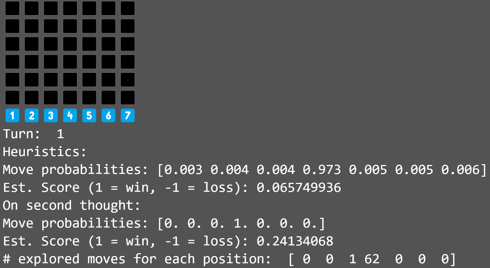
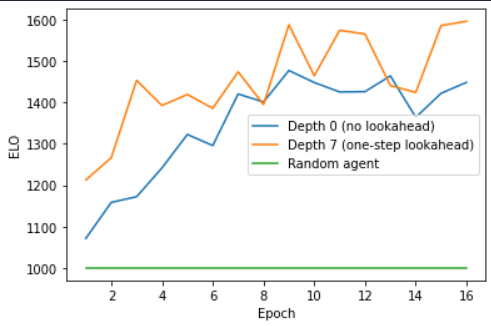

# AlphaZero Connect4 Reinforcement Learning


Welcome to the AlphaZero Connect4 Reinforcement Learning repository! This project is an end-to-end implementation of the AlphaZero algorithm in a Connect4 environment. It includes a training script to train AlphaZero on Connect-4 self play, and a validation script that loads in models and ranks them with an ELO score after evaluating them in a round robin tournament. You can also play against the model yourself to evaluate its strength.

## Quickstart

To get started, check out the `Connect4AlphaZero.ipynb` notebook. This includes the training script to train AlphaZero on Connect-4 self play. 

Once you've trained your model, you can evaluate its performance using the `Connect4A0-Validation.ipynb` notebook. This script loads in models and calculates their ELO. To play against an agent:

```
model = models.load_model("Remote/v3_Boosted.h5", compile = False)
model.compile(optimizer=optimizers.Adam(0.001), loss={'P_head': "binary_crossentropy", 'Q_head': "mse"})
ladder = Ladder()
agent = A0("agent", 12, 64, model) # to change agent strength, modify search depth (default = 64)
ladder.play_match(human_player(),agent,render = True) # set render = False to turn off model commentary.
```
## Files

Here's a brief overview of the other files in this repository:

- `Connect4AlphaZero_Distributed.ipynb`: This notebook distributes training over multiple CPU cores at a time for a speedup, but is slightly unstable.
- `Connect4DQN.ipynb`, `Connect4EVO.ipynb`, `Connect4REINFORCE.ipynb`: These notebooks contain different reinforcement learning algorithms implemented for Connect4.
- `Remote/v3_Boosted.h5`: The weights for the highest-performing model obtained during the training process. Can reliably match strong human amateurs at search depth = 200.



## Installation

To install the necessary dependencies, run:

```bash
pip install -r requirements.txt
```

## Contributing

Contributions are welcome! Please feel free to submit a pull request.

## License

This project is licensed under the terms of the MIT license.